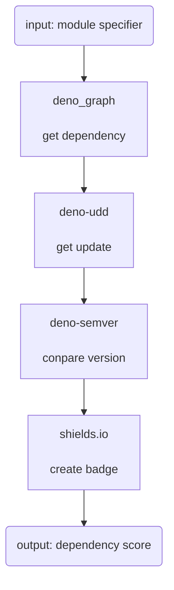

# dependency-score

> **Warning**  Under construction

this library:

oak:

fresh:

This module is using:

- https://deno.land/x/deno_graph@0.28.0
- https://deno.land/x/udd@0.7.3
- https://deno.land/x/semver@v1.4.0
- https://shields.io/category/other#your-badge

